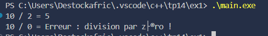
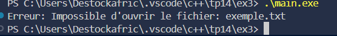
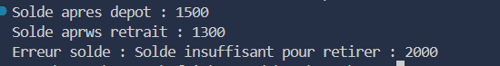

### Exercice 1 : Division sécurisée

#### Objectif  
Utiliser un bloc try-catch pour intercepter une division par zéro.

#### Description  
- Fonction `diviser(int a, int b)` qui retourne le résultat de a / b.  
- Si `b == 0`, une exception est levée avec un message explicite.  
- Tests dans `main` pour différents cas de division.  
- Gestion des exceptions pour afficher un message clair à l’utilisateur.

#### Fonctionnalités  
- Utilisation de **try-catch**.  
- Interception et gestion d’**exceptions standard**.  
- Sécurité lors de la division par zéro.

#### Résultat  

---

### Exercice 2 : Gestion d’un stock de produits

#### Objectif  
Créer et manipuler une exception personnalisée pour la gestion de stock.

#### Description  
- Classe **Produit** avec un stock initial.  
- Méthode `vendre(int quantite)` qui décrémente le stock.  
- Si la quantité demandée dépasse le stock, l’exception **StockInsuffisantException** est levée.  
- Tests dans `main` avec capture de l’exception.

#### Fonctionnalités  
- Création d’**exceptions personnalisées**.  
- Vérification de la validité des opérations sur le stock.  
- Gestion d’erreurs métier avec `try-catch`.

#### Résultat  

---

### Exercice 3 : Lecture d’un fichier avec gestion d’erreurs

#### Objectif  
Gérer les erreurs de lecture d’un fichier texte avec `ifstream` et exceptions.

#### Description  
- Fonction `lireFichier(string nomFichier)` pour ouvrir et lire un fichier ligne par ligne.  
- Vérification que le fichier est correctement ouvert.  
- Levée d’une exception si le fichier est introuvable ou inaccessible.  
- Affichage du contenu ou du message d’erreur.

#### Fonctionnalités  
- Gestion d’**exceptions liées aux fichiers**.  
- Lecture de fichiers texte ligne par ligne.  
- Sécurité et robustesse lors de l’accès aux fichiers.

#### Résultat  

---

### Exercice 4 : Simulation bancaire avec plusieurs exceptions

#### Objectif  
Maîtriser la gestion de plusieurs types d’exceptions dans un contexte bancaire.

#### Description  
- Classe **Compte** avec méthodes `deposer(int)` et `retirer(int)`.  
- Levée d’**exceptions** pour :  
  - Dépôt ou retrait négatif (**MontantInvalideException**).  
  - Solde insuffisant pour un retrait (**SoldeInsuffisantException**).  
- Simulation de différentes opérations dans `main` avec `try-catch` multiples.

#### Fonctionnalités  
- Gestion de **plusieurs exceptions**.  
- Vérification des règles métiers pour les opérations bancaires.  
- Utilisation de blocs `try-catch` imbriqués ou multiples pour un contrôle précis.

#### Résultat  

